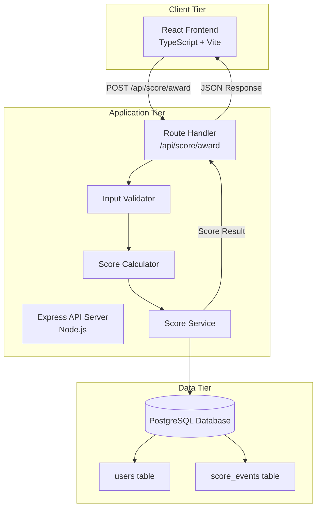

# Technical Design Document

## Overview

The Performance-Weighted Scoring Engine is a full-stack application that calculates and awards points to users based on their performance in coding exercises, quizzes, and project submissions. The system consists of three primary layers:

1. **Backend API (Node.js + Express)**: Server-side scoring logic that validates inputs, calculates points using a performance-weighted algorithm, and persists scoring events
2. **Database Layer (PostgreSQL)**: Stores user profiles with accumulated points and maintains an audit trail of all scoring events
3. **Frontend Interface (React + TypeScript)**: Provides an intuitive UI for users to submit performance data and view detailed scoring breakdowns

The core design principle is **server-side authority**: all scoring calculations occur on the backend to prevent client-side manipulation. The scoring algorithm awards a fixed base of 30 points plus performance-based bonus points (up to 30 additional points), with a quality threshold at 20% performance to discourage low-effort submissions.

### Key Design Goals

- **Security**: Prevent score manipulation by centralizing calculation logic on the server
- **Transparency**: Provide users with clear breakdowns of how points are calculated
- **Auditability**: Maintain complete records of all scoring events for analysis and debugging
- **User Experience**: Deliver immediate feedback with helpful warnings for low-effort submissions
- **Maintainability**: Separate concerns across routing, business logic, data access, and UI layers

## Architecture

### System Architecture

The application follows a three-tier architecture pattern:



### Request Flow

1. **User Interaction**: User adjusts performance slider (0-100%) and clicks "Submit Results"
2. **API Request**: Frontend sends POST request with `user_id`, `activity_type`, and `performance_percentage`
3. **Validation**: Server validates request parameters (user_id presence, activity_type enum, performance range)
4. **Calculation**: Server calculates base points (30), bonus points (performance × 0.3, capped at 30), and low-effort flag (performance < 20%)
5. **Persistence**: Server creates score_event record and updates user's total_points atomically
6. **Response**: Server returns breakdown (base, bonus, total, low_effort_flag) to client
7. **Display**: Frontend shows point breakdown and optional low-effort warning

### Technology Stack

**Backend**:
- **Runtime**: Node.js (JavaScript runtime)
- **Framework**: Express 5.x (web application framework)
- **Database Client**: pg 8.x (PostgreSQL client for Node.js)
- **Environment Management**: dotenv (environment variable loading)
- **CORS**: cors middleware (cross-origin resource sharing)

**Frontend**:
- **Framework**: React 18.x (UI library)
- **Language**: TypeScript 5.x (type-safe JavaScript)
- **Build Tool**: Vite 4.x (fast development and build tooling)
- **Styling**: CSS Modules or inline styles (to be determined during implementation)

**Database**:
- **RDBMS**: PostgreSQL (relational database with ACID guarantees)

## Components and Interfaces

### Backend Components

#### 1. API Router (`routes/score.js`)

**Responsibility**: Define HTTP endpoints and delegate to business logic

**Interface**:
```javascript
// POST /api/score/award
// Request Body: { user_id: number, activity_type: string, performance_percentage: number }
// Response: { base_points: number, bonus_points: number, total_points: number, low_effort: boolean }
// Status Codes: 200 (success), 400 (validation error), 404 (user not found), 500 (server error)
```

**Dependencies**: Score Service, Input Validator

#### 2. Input Validator (`validators/scoreValidator.js`)

**Responsibility**: Validate incoming request parameters

**Interface**:
```javascript
function validateScoreRequest(body) {
  // Returns: { valid: boolean, errors: string[] }
  // Validates:
  // - user_id is present and is a positive integer
  // - activity_type is one of: 'CODING_EXERCISE', 'QUIZ', 'PROJECT_SUBMISSION'
  // - performance_percentage is a number between 0 and 100 (inclusive)
}
```

**Validation Rules**:
- `user_id`: Required, must be a positive integer
- `activity_type`: Required, must be one of the three allowed enum values
- `performance_percentage`: Required, must be a number in range [0, 100]

#### 3. Score Calculator (`services/scoreCalculator.js`)

**Responsibility**: Implement the scoring algorithm (pure function, no side effects)

**Interface**:
```javascript
function calculateScore(performance_percentage) {
  // Returns: { 
  //   base_points: number,      // Always 30
  //   bonus_points: number,     // 0 if performance < 20, else min(performance * 0.3, 30)
  //   total_points: number,     // base_points + bonus_points
  //   low_effort: boolean       // true if performance < 20
  // }
}
```

**Algorithm**:
```
base_points = 30
if performance_percentage < 20:
    bonus_points = 0
    low_effort = true
else:
    bonus_points = min(performance_percentage * 0.3, 30)
    low_effort = false
total_points = base_points + bonus_points
```

**Edge Cases**:
- Performance = 0: base=30, bonus=0, total=30, low_effort=true
- Performance = 19: base=30, bonus=0, total=30, low_effort=true
- Performance = 20: base=30, bonus=6, total=36, low_effort=false
- Performance = 100: base=30, bonus=30 (capped), total=60, low_effort=false

#### 4. Score Service (`services/scoreService.js`)

**Responsibility**: Orchestrate database operations for scoring events

**Interface**:
```javascript
async function awardScore(user_id, activity_type, performance_percentage) {
  // Returns: Promise<{ base_points, bonus_points, total_points, low_effort }>
  // Throws: UserNotFoundError, DatabaseError
  // Side effects:
  // - Inserts record into score_events table
  // - Updates total_points in users table
}
```

**Transaction Flow**:
1. Begin database transaction
2. Verify user exists in users table (throw 404 if not)
3. Calculate score using Score Calculator
4. Insert score_event record with all calculated values
5. Update user's total_points (current + new total)
6. Commit transaction
7. Return calculated score breakdown

#### 5. Database Client (`db/client.js`)

**Responsibility**: Manage PostgreSQL connection pool

**Interface**:
```javascript
const pool = new Pool({
  connectionString: process.env.DATABASE_URL
});

async function query(text, params) {
  // Returns: Promise<QueryResult>
  // Executes parameterized query against PostgreSQL
}
```

**Configuration**:
- Connection pooling enabled for performance
- Parameterized queries to prevent SQL injection
- Graceful error handling and connection retry logic

### Frontend Components

#### 1. ExerciseCompleteScreen Component

**Responsibility**: Main UI component for performance submission and score display

**Props**: 
```typescript
interface ExerciseCompleteScreenProps {
  userId: number;
  activityType: 'CODING_EXERCISE' | 'QUIZ' | 'PROJECT_SUBMISSION';
}
```

**State**:
```typescript
interface ComponentState {
  performancePercentage: number;  // 0-100, controlled by slider
  isSubmitting: boolean;          // true during API request
  scoreResult: ScoreResult | null; // API response data
  error: string | null;           // Error message if request fails
}
```

**UI Elements**:
- Performance slider (0-100 range input)
- Current value display (e.g., "Performance: 75%")
- Submit Results button (disabled during submission)
- Score breakdown display (visible after successful submission)
- Low-effort warning (conditionally visible)
- Error message display (conditionally visible)

#### 2. API Client (`api/scoreApi.ts`)

**Responsibility**: Handle HTTP communication with backend

**Interface**:
```typescript
interface ScoreRequest {
  user_id: number;
  activity_type: 'CODING_EXERCISE' | 'QUIZ' | 'PROJECT_SUBMISSION';
  performance_percentage: number;
}

interface ScoreResponse {
  base_points: number;
  bonus_points: number;
  total_points: number;
  low_effort: boolean;
}

async function submitScore(request: ScoreRequest): Promise<ScoreResponse> {
  // Throws: NetworkError, ValidationError, NotFoundError, ServerError
}
```

**Error Handling**:
- Network errors: "Unable to connect to server. Please check your connection."
- 400 errors: Display server-provided validation message
- 404 errors: "User not found. Please contact support."
- 500 errors: "Server error. Please try again later."

#### 3. ScoreBreakdown Component

**Responsibility**: Display calculated score breakdown

**Props**:
```typescript
interface ScoreBreakdownProps {
  basePoints: number;
  bonusPoints: number;
  totalPoints: number;
}
```

**Display Format**: "Base: 30 points · Bonus: 15 points · Total earned: 45 points"

#### 4. LowEffortWarning Component

**Responsibility**: Display warning for low-effort submissions

**Props**:
```typescript
interface LowEffortWarningProps {
  visible: boolean;
}
```

**Display**: "We noticed this submission was rushed. Consider giving it another try."

**Styling**: Subtle warning color (e.g., amber/yellow), not harsh red

## Data Models

### Database Schema

#### users Table

```sql
CREATE TABLE users (
  id SERIAL PRIMARY KEY,
  total_points INTEGER NOT NULL DEFAULT 0,
  created_at TIMESTAMP NOT NULL DEFAULT CURRENT_TIMESTAMP
);
```

**Columns**:
- `id`: Auto-incrementing primary key
- `total_points`: Accumulated points across all scoring events, defaults to 0
- `created_at`: Timestamp of user record creation

**Indexes**:
- Primary key index on `id` (automatic)

**Constraints**:
- `total_points` must be non-negative (CHECK constraint: `total_points >= 0`)

#### score_events Table

```sql
CREATE TABLE score_events (
  id SERIAL PRIMARY KEY,
  user_id INTEGER NOT NULL REFERENCES users(id),
  activity_type VARCHAR(50) NOT NULL,
  performance_percentage NUMERIC(5,2) NOT NULL,
  base_points INTEGER NOT NULL,
  bonus_points NUMERIC(5,2) NOT NULL,
  total_points NUMERIC(5,2) NOT NULL,
  low_effort BOOLEAN NOT NULL,
  created_at TIMESTAMP NOT NULL DEFAULT CURRENT_TIMESTAMP
);
```

**Columns**:
- `id`: Auto-incrementing primary key
- `user_id`: Foreign key reference to users table
- `activity_type`: Enum-like string ('CODING_EXERCISE', 'QUIZ', 'PROJECT_SUBMISSION')
- `performance_percentage`: User's performance score (0.00 to 100.00)
- `base_points`: Fixed base points awarded (always 30)
- `bonus_points`: Performance-based bonus (0.00 to 30.00)
- `total_points`: Sum of base and bonus points
- `low_effort`: Flag indicating performance below threshold
- `created_at`: Timestamp of scoring event

**Indexes**:
- Primary key index on `id` (automatic)
- Index on `user_id` for efficient user history queries
- Index on `created_at` for time-based queries

**Constraints**:
- Foreign key constraint on `user_id` references `users(id)`
- CHECK constraint: `performance_percentage >= 0 AND performance_percentage <= 100`
- CHECK constraint: `base_points = 30`
- CHECK constraint: `bonus_points >= 0 AND bonus_points <= 30`
- CHECK constraint: `total_points = base_points + bonus_points`

### TypeScript Type Definitions

```typescript
// Frontend types
type ActivityType = 'CODING_EXERCISE' | 'QUIZ' | 'PROJECT_SUBMISSION';

interface ScoreRequest {
  user_id: number;
  activity_type: ActivityType;
  performance_percentage: number;
}

interface ScoreResponse {
  base_points: number;
  bonus_points: number;
  total_points: number;
  low_effort: boolean;
}

interface User {
  id: number;
  total_points: number;
  created_at: string;
}

interface ScoreEvent {
  id: number;
  user_id: number;
  activity_type: ActivityType;
  performance_percentage: number;
  base_points: number;
  bonus_points: number;
  total_points: number;
  low_effort: boolean;
  created_at: string;
}
```


## Correctness Properties

*A property is a characteristic or behavior that should hold true across all valid executions of a system—essentially, a formal statement about what the system should do. Properties serve as the bridge between human-readable specifications and machine-verifiable correctness guarantees.*

### Property 1: Score Calculation Correctness

*For any* valid performance_percentage value in the range [0, 100], the score calculation SHALL satisfy all of the following:
- base_points = 30
- If performance_percentage < 20, then bonus_points = 0
- If performance_percentage >= 20, then bonus_points = min(performance_percentage × 0.3, 30)
- total_points = base_points + bonus_points
- bonus_points is in the range [0, 30]
- total_points is in the range [30, 60]

**Validates: Requirements 2.1, 2.2, 2.3, 2.4, 2.5, 3.1, 3.2, 3.3, 3.4, 3.5**

### Property 2: Low Effort Flag Correctness

*For any* valid performance_percentage value in the range [0, 100], the low_effort flag SHALL be set according to the threshold:
- If performance_percentage < 20, then low_effort = true
- If performance_percentage >= 20, then low_effort = false

**Validates: Requirements 2.6, 2.7, 3.1, 3.2, 3.4, 3.5**

### Property 3: Input Validation Correctness

*For any* request submitted to the scoring endpoint, the validation SHALL correctly identify valid and invalid inputs:
- Requests missing user_id SHALL be rejected with 400 status
- Requests with activity_type not in {CODING_EXERCISE, QUIZ, PROJECT_SUBMISSION} SHALL be rejected with 400 status
- Requests with performance_percentage < 0 or > 100 SHALL be rejected with 400 status
- Requests with valid user_id, valid activity_type, and performance_percentage in [0, 100] SHALL pass validation
- All rejected requests SHALL include a descriptive error message

**Validates: Requirements 1.2, 1.3, 1.4, 1.5**

### Property 4: Points Accumulation Correctness

*For any* user with an initial total_points value and any awarded points from a scoring event, the updated total_points SHALL equal the sum of the initial total_points and the awarded points:
- new_total_points = initial_total_points + awarded_total_points
- The accumulation operation SHALL be commutative (order of scoring events doesn't affect final total)

**Validates: Requirements 5.2**

## Error Handling

### Backend Error Handling

**Validation Errors (400 Bad Request)**:
- Missing or invalid `user_id`: "user_id is required and must be a positive integer"
- Invalid `activity_type`: "activity_type must be one of: CODING_EXERCISE, QUIZ, PROJECT_SUBMISSION"
- Invalid `performance_percentage`: "performance_percentage must be a number between 0 and 100"

**Not Found Errors (404 Not Found)**:
- User doesn't exist: "User with id {user_id} not found"

**Server Errors (500 Internal Server Error)**:
- Database connection failure: Log detailed error, return generic message "An error occurred while processing your request"
- Transaction failure: Rollback transaction, log error, return generic message
- Unexpected errors: Log stack trace, return generic message

**Error Response Format**:
```json
{
  "error": "Descriptive error message",
  "status": 400
}
```

### Frontend Error Handling

**Network Errors**:
- Display: "Unable to connect to server. Please check your connection and try again."
- User action: Retry button available

**Validation Errors (400)**:
- Display: Error message from API response
- User action: Correct input and resubmit

**Not Found Errors (404)**:
- Display: "User not found. Please contact support if this problem persists."
- User action: Contact support link

**Server Errors (500)**:
- Display: "Server error. Please try again later."
- User action: Retry button available

**Loading States**:
- Disable submit button during API request
- Show loading indicator (spinner or progress message)
- Prevent duplicate submissions

### Database Error Handling

**Connection Errors**:
- Implement connection retry logic (3 attempts with exponential backoff)
- Log connection failures with timestamp and error details
- Fail gracefully if DATABASE_URL is not configured

**Transaction Errors**:
- Wrap scoring operations in database transactions
- Rollback on any error to maintain data consistency
- Log transaction failures for debugging

**Constraint Violations**:
- Foreign key violation (invalid user_id): Return 404 to client
- Check constraint violation: Log as critical error (indicates bug in calculation logic)

## Testing Strategy

### Unit Testing

**Backend Unit Tests** (using Jest or Mocha):

1. **Score Calculator Tests** (pure function, no mocks needed):
   - Test specific examples: performance 0, 19, 20, 21, 50, 100
   - Test edge cases: negative values (should be caught by validation), values > 100
   - Test decimal precision: performance 33.33 should give bonus 9.999
   - Verify base_points always equals 30
   - Verify bonus_points never exceeds 30
   - Verify total_points = base_points + bonus_points

2. **Input Validator Tests**:
   - Test missing user_id
   - Test invalid activity_type values (empty string, wrong enum, null)
   - Test performance_percentage boundaries (0, 100, -1, 101, NaN, null)
   - Test valid inputs pass validation

3. **API Route Handler Tests** (with mocked service layer):
   - Test successful request returns 200 with correct structure
   - Test validation errors return 400
   - Test user not found returns 404
   - Test service errors return 500

**Frontend Unit Tests** (using React Testing Library):

1. **Component Rendering Tests**:
   - Test slider renders with correct range (0-100)
   - Test submit button renders and is clickable
   - Test score breakdown displays after successful submission
   - Test low-effort warning displays when flag is true
   - Test error messages display for different error types

2. **API Client Tests** (with mocked fetch):
   - Test request payload structure
   - Test response parsing
   - Test error handling for different status codes

### Property-Based Testing

**Property Test Configuration**:
- Library: fast-check (JavaScript/TypeScript property-based testing library)
- Minimum iterations: 100 per property test
- Each test tagged with: `Feature: performance-weighted-scoring, Property {number}: {property_text}`

**Property Test Suite**:

1. **Property 1: Score Calculation Correctness**
   ```javascript
   // Feature: performance-weighted-scoring, Property 1: Score Calculation Correctness
   fc.assert(
     fc.property(
       fc.float({ min: 0, max: 100 }), // Generate random performance values
       (performance) => {
         const result = calculateScore(performance);
         
         // Verify base_points always 30
         expect(result.base_points).toBe(30);
         
         // Verify bonus calculation
         if (performance < 20) {
           expect(result.bonus_points).toBe(0);
         } else {
           const expectedBonus = Math.min(performance * 0.3, 30);
           expect(result.bonus_points).toBeCloseTo(expectedBonus, 2);
         }
         
         // Verify total = base + bonus
         expect(result.total_points).toBeCloseTo(
           result.base_points + result.bonus_points, 2
         );
         
         // Verify ranges
         expect(result.bonus_points).toBeGreaterThanOrEqual(0);
         expect(result.bonus_points).toBeLessThanOrEqual(30);
         expect(result.total_points).toBeGreaterThanOrEqual(30);
         expect(result.total_points).toBeLessThanOrEqual(60);
       }
     ),
     { numRuns: 100 }
   );
   ```

2. **Property 2: Low Effort Flag Correctness**
   ```javascript
   // Feature: performance-weighted-scoring, Property 2: Low Effort Flag Correctness
   fc.assert(
     fc.property(
       fc.float({ min: 0, max: 100 }),
       (performance) => {
         const result = calculateScore(performance);
         
         if (performance < 20) {
           expect(result.low_effort).toBe(true);
         } else {
           expect(result.low_effort).toBe(false);
         }
       }
     ),
     { numRuns: 100 }
   );
   ```

3. **Property 3: Input Validation Correctness**
   ```javascript
   // Feature: performance-weighted-scoring, Property 3: Input Validation Correctness
   fc.assert(
     fc.property(
       fc.record({
         user_id: fc.option(fc.integer({ min: 1 }), { nil: undefined }),
         activity_type: fc.oneof(
           fc.constant('CODING_EXERCISE'),
           fc.constant('QUIZ'),
           fc.constant('PROJECT_SUBMISSION'),
           fc.string() // Invalid strings
         ),
         performance_percentage: fc.oneof(
           fc.float({ min: 0, max: 100 }), // Valid range
           fc.float({ min: -100, max: -0.01 }), // Negative
           fc.float({ min: 100.01, max: 200 }) // Too high
         )
       }),
       (request) => {
         const validation = validateScoreRequest(request);
         
         // Determine if request should be valid
         const hasValidUserId = request.user_id !== undefined && request.user_id > 0;
         const hasValidActivityType = ['CODING_EXERCISE', 'QUIZ', 'PROJECT_SUBMISSION']
           .includes(request.activity_type);
         const hasValidPerformance = request.performance_percentage >= 0 
           && request.performance_percentage <= 100;
         
         const shouldBeValid = hasValidUserId && hasValidActivityType && hasValidPerformance;
         
         expect(validation.valid).toBe(shouldBeValid);
         
         if (!validation.valid) {
           expect(validation.errors.length).toBeGreaterThan(0);
         }
       }
     ),
     { numRuns: 100 }
   );
   ```

4. **Property 4: Points Accumulation Correctness**
   ```javascript
   // Feature: performance-weighted-scoring, Property 4: Points Accumulation Correctness
   fc.assert(
     fc.property(
       fc.integer({ min: 0, max: 10000 }), // Initial points
       fc.float({ min: 0, max: 100 }), // Performance for first event
       fc.float({ min: 0, max: 100 }), // Performance for second event
       (initialPoints, perf1, perf2) => {
         const score1 = calculateScore(perf1);
         const score2 = calculateScore(perf2);
         
         // Test accumulation
         const afterFirst = initialPoints + score1.total_points;
         const afterSecond = afterFirst + score2.total_points;
         
         expect(afterSecond).toBeCloseTo(
           initialPoints + score1.total_points + score2.total_points, 2
         );
         
         // Test commutativity (order doesn't matter)
         const reverseOrder = initialPoints + score2.total_points + score1.total_points;
         expect(afterSecond).toBeCloseTo(reverseOrder, 2);
       }
     ),
     { numRuns: 100 }
   );
   ```

### Integration Testing

**Database Integration Tests**:
1. Test score_events record creation with all fields
2. Test user total_points update after scoring
3. Test transaction rollback on error
4. Test foreign key constraint (invalid user_id returns 404)
5. Test concurrent scoring events for same user (race condition handling)

**API Integration Tests**:
1. Test end-to-end scoring flow: request → calculation → persistence → response
2. Test CORS headers on cross-origin requests
3. Test error responses for various failure scenarios

**Frontend-Backend Integration Tests** (optional, using Cypress or Playwright):
1. Test complete user flow: adjust slider → submit → see results
2. Test error handling with real API errors
3. Test loading states during API requests

### Test Coverage Goals

- **Unit test coverage**: Minimum 90% for business logic (calculator, validator, service)
- **Property test coverage**: All 4 correctness properties implemented with 100 iterations each
- **Integration test coverage**: All database operations and API endpoints
- **Frontend test coverage**: All UI components and user interactions

### Testing Best Practices

1. **Isolation**: Unit tests should not depend on database or external services (use mocks)
2. **Determinism**: Tests should produce consistent results (avoid random data in unit tests, use it in property tests)
3. **Fast execution**: Unit and property tests should run in < 5 seconds total
4. **Clear assertions**: Each test should have clear, specific assertions with helpful error messages
5. **Test data**: Use realistic test data that represents actual usage patterns
6. **Edge cases**: Explicitly test boundary conditions (0, 20, 100) in unit tests, rely on generators for property tests

## Implementation Notes

### Development Workflow

1. **Phase 1: Backend Core**
   - Set up Express server with basic routing
   - Implement score calculator (pure function)
   - Write property-based tests for calculator
   - Implement input validator
   - Write unit tests for validator

2. **Phase 2: Database Layer**
   - Create database schema (users and score_events tables)
   - Implement database client with connection pooling
   - Implement score service with transaction support
   - Write integration tests for database operations

3. **Phase 3: API Integration**
   - Connect route handlers to service layer
   - Implement error handling middleware
   - Configure CORS
   - Write API integration tests

4. **Phase 4: Frontend Core**
   - Set up React component structure
   - Implement ExerciseCompleteScreen with slider and submit button
   - Implement API client
   - Write component unit tests

5. **Phase 5: Frontend Polish**
   - Implement score breakdown display
   - Implement low-effort warning
   - Implement error handling and loading states
   - Add styling and responsive design

6. **Phase 6: End-to-End Testing**
   - Run full integration tests
   - Test deployment configuration
   - Verify environment variable handling

### Security Considerations

1. **SQL Injection Prevention**: Use parameterized queries exclusively (pg library supports this)
2. **Input Validation**: Validate all inputs on server side (never trust client data)
3. **Error Message Safety**: Don't expose internal implementation details in error messages
4. **Environment Variables**: Never commit .env files, use .env.example as template
5. **CORS Configuration**: In production, restrict CORS to specific frontend origin (not wildcard)

### Performance Considerations

1. **Database Connection Pooling**: Use pg Pool to reuse connections (configured in db/client.js)
2. **Transaction Efficiency**: Keep transactions short to avoid locking issues
3. **Index Usage**: Ensure indexes on user_id and created_at for efficient queries
4. **Frontend Debouncing**: Consider debouncing slider changes if real-time preview is added
5. **API Response Size**: Keep responses minimal (only necessary fields)

### Scalability Considerations

1. **Database Scaling**: PostgreSQL can handle millions of score_events with proper indexing
2. **Horizontal Scaling**: Stateless API design allows multiple server instances behind load balancer
3. **Caching**: Consider caching user total_points in Redis for high-traffic scenarios
4. **Async Processing**: For high volume, consider queueing score events (e.g., with Bull/Redis)

### Deployment Checklist

- [ ] Environment variables configured (DATABASE_URL, PORT, CORS_ORIGIN)
- [ ] Database schema created (run migration scripts)
- [ ] Test users created in database
- [ ] Backend server starts successfully
- [ ] Frontend builds without errors
- [ ] CORS configured for production frontend origin
- [ ] Error logging configured (consider service like Sentry)
- [ ] Health check endpoint implemented (/api/health)
- [ ] Database connection pooling configured appropriately for production load
- [ ] SSL/TLS configured for production API

### Future Enhancements

1. **Analytics Dashboard**: Visualize scoring trends, activity type distribution, low-effort rates
2. **Leaderboard**: Display top users by total_points
3. **Activity History**: Show user's past scoring events with filtering
4. **Bonus Multipliers**: Add time-based or streak-based multipliers
5. **Achievement System**: Award badges for milestones (e.g., "100 exercises completed")
6. **Admin Panel**: Allow administrators to adjust scoring parameters or manually award points
7. **Webhooks**: Notify external systems when users reach point thresholds
8. **Rate Limiting**: Prevent abuse by limiting submissions per user per time period
